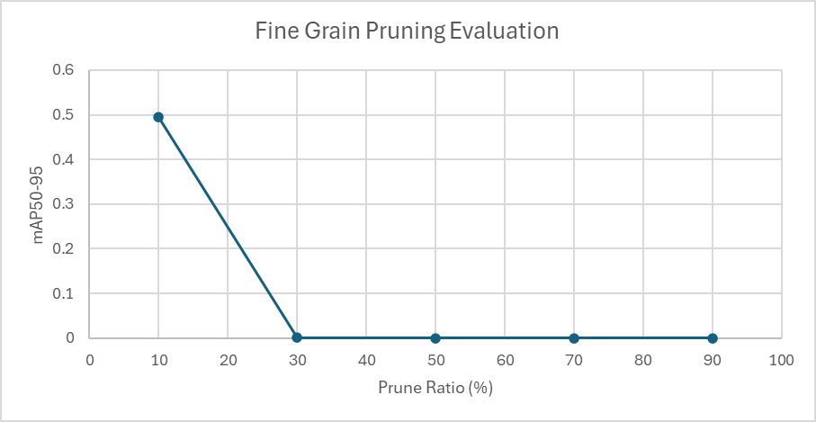
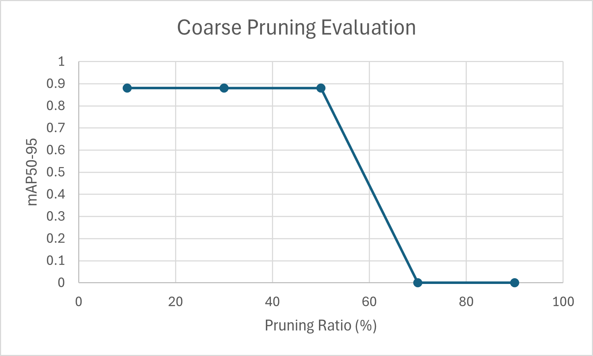

# Yolo
Gestify's hand recognition model is based on Ultralytics' detection model, and was trained on a subset of HaGRID's gestures dataset. The trained model was then pruned and quantized for running on an Android device.

## Implementation
The trained model is based on Ultralytics's Yolo11n detection model, and is trained on Hagrid's hand gesture  dataset.

### Quantization
Quantization is important as a post processing step to increase inference speed and to reduce memory usage. Following the workflow from Ultralytics training framework, quantization is done when the model is exported to other formats.

The model originally has elements in 32-bit floating point format. We use post-training quantization to convert the model into 16-bit floating point, and 8-bit integer variants. When quantizing to 8-bit integers, we need a calibration dataset which is representative of the real-world usage. We construct this dataset by taking a subset of the images in each gesture class from the hagrid dataset. By default we randomly select 10 images from each gesture class.

### Coarse Pruning
Coarse pruning, also known as structured pruning, removes entire channels, layers, or blocks from the model to reduce its overall complexity while maintaining as much accuracy as possible. This process is particularly effective for deploying the model on resource-constrained devices such as Android smartphones. To achieve coarse pruning with the trained 10 gestures model, we use the ln_structured function.

### Fine-Grained Pruning
Fine-grained unstructured pruning removes individual weights (rather than entire neurons or filters) based on a criterion - in this case is magnitude (L1 norm). Unlike structured pruning, which eliminates whole channels for hardware efficiency, fine-grained pruning maximizes sparsity by zeroing out the least important weights, often leading to higher compression rates without altering layer shapes. We applied this method to prune a pretrained YOLO model that recognizes 10 gestures.

It is important to note that while fine-grained pruning increases sparsity, speedups are only guaranteed on specialized hardware (e.g., NPUs/Tensor Cores with sparse compute support). For Android devices using standard CPU/GPU, unstructured pruning may reduce model size but often fails to improve latency due to irregular memory access patterns. 

## Optimization Decision Reasoning
### Fine Grain Pruning
To select the fine grain pruning ratio, a sensitivity analysis was conducted. Starting from a ratio of 10% to 90%, each pruned model was fine tuned for a maximum of 15 epochs. The pruning ratio vs accuracy is shown below.

As can be seen even with 10% of the model pruned, the accuracy falls from around 0.88 from the original model to around 0.5. Even with pruning ratio around 30%, the model's accuracy starts to drop to around 0.

Due to the poor performance of the fine grain pruning, we decided not to perform fine grain pruning for our final model. 

### Coarse Pruning
To select the coarse pruning ratio, a sensitivity analysis was conducted. Starting from a ratio of 10% to 90%, each pruned model was fine tuned for a maximum of 10 epochs with a patience of 3 epochs. The pruning ratio vs accuracy is shown below.

Based on this analysis, the coarse pruning ratio should be set at 50%, as any higher ratio results in total accuracy loss.

### Quantization Level
Based on the [inference time](#inference-speed) results, the quantization level should be chosen based on the device. If the GPU is used, the full precision model should be used. Otherwise if the CPU is used, the integer model should be used.

TODO:
* How quantization output type was selected

## Setup and Training
The code base is split into 4 distinct repositories. The [Hagrid](https://github.com/Gestify-ML/hagrid) repo contains the dataset acquisition and preparation scripts. It was forked and modified to allow it to covert from the hagrid dataset format to the yolo dataset format. The [Ultralytics](https://github.com/Gestify-ML/ultralytics) repo contains the training framework. It was forked and modified to use the dataset from the converted hagrid dataset. The [Gestify](https://github.com/Gestify-ML/gestify) repo contains the Gestify app which runs the trained model. And lastly, the [Yolo](https://github.com/Gestify-ML/yolo) repo contains the scripts to train, prune, quantize, and export the hand detection model. It also contains a desktop demo to run a model.

The yolo repo has the following scripts:
* `train.py`, trains or resumes training for a model. The dataset and base model are configurable through command line arguments. By default, the base model is the `yolo11n.pt` detection model from Ultralytics.
* `quantization.py`, quantizes the trained model into several sizes and format. Formats being, ONNX in float32, float16, and int8. And tensorflow lite in float32 and float16. When quantizing to int8, 10 images from each class is selected as the calibration dataset.
* `fine_prune.py`, performs unstructured (fine-grain) pruning on a trained YOLO model. It prunes weights (not entire channels/neurons) based on L1 magnitude. 
* TODO coarse prune scripts

### Dataset and Training Environment Setup
To use the training scripts in this repo, the dataset needs to be setup first.
1. Download and unzip the lightweight version of the HaGRID dataset from the repo link, along with the annotations. 
2. Clone the Hagrid repo from the organization and cd into it.
3. Create the virtual environment
   1. uv venv -p 3.11.11
   2. source .venv/bin/activate
   3. uv install torch torchvision torchaudio --index-url https://download.pytorch.org/whl/cu118
   4. uv pip install omegaconf mediapipe albumentations torchmetrics tensorflow pandas tdqm pycocotools
4. Modify the "converters/converter_config.yaml" file.
   1. Change "dataset_annotations" and "dataset_folder" to the unzipped archive directories.
   2. Select which targets are desired.
      * More targets take longer to train.
      * Order matters, when trying to add more targets after converting. Make sure to maintain strict order when adding more. Removing targets from an already converted dataset requires extensive fixups, it’s probably easier to just convert from scratch.
5. Run the conversion script
   1. python -m converters.hagrid_to_yolo
      * Check script arguments with "-h" if needed,
      * --cfg, if you want to use a different config file than "converters/converter_config.yaml"
      * --out, if you want to change the output directory
      * --mode, should be left as the default, "gestures"

Next to set up the environment for this repo, follow the following steps:
1. Clone yolo training repo from the organization and cd into it
2. Create virtual environment
   1. uv venv -p 3.12
   2. Source ./venv/bin/activate
3. Install customized Ultralytics from the organization
   1. uv pip install git+https://github.com/Gestify-ML/ultralytics.git
4. Enter screen session with "tmux", take note of which login node (login-01, login-02, etc) you are logged into as you can only reconnect on the same one. If you ever get disconnected use "tmux a" to reconnect. To disconnect from a session, use "ctrl-b” and then "d"
5. Enter an interactive job. The following requests one node, with 16 cores, 128GB of ram, 24hrs, and 2 gpus
   1. srun -N 1 -n 16 --mem=131072 --time=1440 --partition=academic --gres=gpu:2 --pty /usr/bin/bash
6. Enable virtual environment again, make sure you’re in the yolo directory,
   1. Source ./.venv/bin/activate
7. Run training script train.py, check options available with "-h"

### Running Scripts
`train.py`, is used for training a model, it has the following arguments,
* `name`, A name for the model
* `--dataset`, The dataset to use, this must be given if not resuming.
* `--project`, The directory to store the model under.
* `--base-model`, The base model to train from. This can be one from Ultralytics like `yolo11n.pt` or a local model, say one that was pruned.
* `--resume`, resume training a model if it was stopped or interrupted. This should not be used if training a model that was just pruned, in that case treat it as a base model.
* `--pruned-model`, switch that is needed if the base model is pruned. This maintains the pruning.
* `--epochs`, maximum number of epochs to train for.
* `--patience`, how many epochs to wait without validation improvement to stop early.

---

`quantization.py`, is used for quantizing and exporting a model into several format. It has the following arguments,
* `model`, path to the model to quantize. The outputs from this script will be placed into the same directory.
* `dataset`, path to the dataset to use for calibration data.
* `output`, path to write quantized models.

The artifacts from the script are as follows,
* `[model_name]_full.onnx`, float32 in ONNX format
* `[model_name]_half.onnx`, float16 in ONNX format
* `[model_name]_int8.onnx`, int8 in ONNX format
* `[model_name]_full.tflite`, float32 in tensorflow lite format
* `[model_name]_half.tflite`, float16 in tensorflow lite format

---

`coarse_prune.py` is used for performing structured (coarse) pruning on a trained YOLO model. It removes redundant channels and layers to optimize performance for mobile deployment. The script has the following arguments:
* `--model` – The path to the trained YOLO model to be pruned.
* `--sparsity` – The fraction of the model to prune (e.g., 0.3 removes 30% of the least important channels).
* `--output` – The directory where the pruned model will be saved.
* `--fine-tune` – (Optional) If set, the pruned model will be fine-tuned on the dataset to recover accuracy.
* `--epochs` – (Optional) The number of fine-tuning epochs (default: 10). Only relevant if --fine-tune is enabled.

---

`fine_prune.py`, is used for performing unstructured (fine-grained) pruning on a trained YOLO model. It prunes weights (not entire channels/neurons) based on L1 magnitude. The script has the following arguments:
* `name`, A name for the model
* `--dataset`, The dataset to use, this must be given if not resuming.
* `--project`, The directory to store the model under.
* `--base-model`, The base model to train from. This can be one from Ultralytics like `yolo11n.pt` or a local model, say one that was pretrained.
* `--prune-ratio`, Percentage of weights in each layer to prune (0.0 - 1.0).

---

`reapply_prune.py`, is used to reapply the pruning after fine tuning a fine pruned model. The script has the following arguments:
* `pruned`, path to the pruned model before fine tuning.
* `tuned`, path to the fine tuned model.
* `output`, path to output the modified model.

---

`measure_inference.py`, is used to measure the average inference speed of a model. The script has the following arguments:
* `model`, path to the model to test.
* `video`, path to a video to run predictions on.
* `--device`, the device to use, by default it is the "cpu".

---

`demo.py`, is used to run a model on a PC in a demo website. The script has the following arguments:
* `model`, path to the model to run the demo with.

---

To run the Gestify app, refer to the Gestify repo.

## Benchmark Results

### Inference Speed
The average inference speed was computed by running the model with the frames from a prepared [video](videos/InferenceTest.mp4). The inference measurements were done on a desktop PC using the GPU or the CPU. Full precision 32-bit floating point, half precision 16-bit floating point, and 8-bit integer models were tested. The GPU used is a NVIDIA RTX 3060Ti, while the CPU used is a AMD Ryzen 9 5900X 12-Core Processor. The following table lists the average inference time for each device and model configuration.

|Device|Model                                  |Inference Time (ms)|
|------|---------------------------------------|-------------------|
|gpu   |ten_gestures_full                      |8.551              |
|gpu   |ten_gestures_half                      |9.884              |
|gpu   |ten_gestures_int8                      |18.479             |
|gpu   |ten_gestures_coarse_prune_50_tuned_full|9.650              |
|gpu   |ten_gestures_coarse_prune_50_tuned_half|10.287             |
|gpu   |ten_gestures_coarse_prune_50_tuned_int8|19.034             |
|cpu   |ten_gestures_full                      |29.960             |
|cpu   |ten_gestures_half                      |40.997             |
|cpu   |ten_gestures_int8                      |26.191             |
|cpu   |ten_gestures_coarse_prune_50_tuned_full|29.783             |
|cpu   |ten_gestures_coarse_prune_50_tuned_half|44.529             |
|cpu   |ten_gestures_coarse_prune_50_tuned_int8|27.625             |

When running on the GPU, the floating point models are comparable. Though the integer model is much slower, which might be due to how the GPU is designed to accelerate floating point operations. When comparing between the base model and the pruned model, the inference times are roughly the same.
When running on the CPU, the inference time is much slower than the GPU. Interestingly, half precision is almost twice as slow as the full precision model. Additionally, the integer model is marginally faster than the full precision model. Again, there is little difference between the base model and the pruned model.

* Resource Utilization
  * Memory usage monitoring
  * CPU/GPU efficiency
  * Battery impact assessment
* Accuracy Metrics (Initial Accuracy of the model will not be evaluated)
  * Model accuracy comparison
  * Performance degradation analysis
